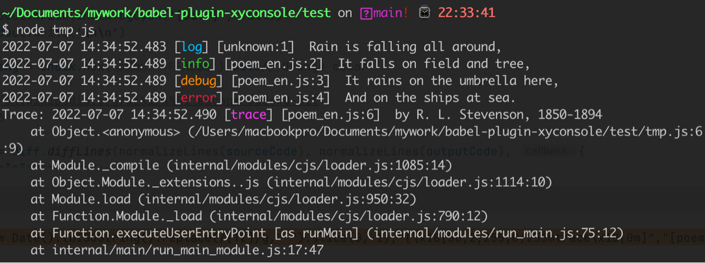

# babel-plugin-xyconsole
A tool of console.log

# Catalogue


# How to use
## Command
```shell
yarn add babel-plugin-xyconsole
babel --plugins babel-plugin-xyconsole ./yourcode.js
```
## Webpack
```shell

```

## Cmd
```shell
babel.config.js
```

# Sample
## auto loglevel - 1


## auto loglevel - 2


## auto loglevel - 3


# Thanks
- https://github.com/RReverser/babel-plugin-hello-world
- https://github.com/QuarkGluonPlasma/babel-plugin-exercize
